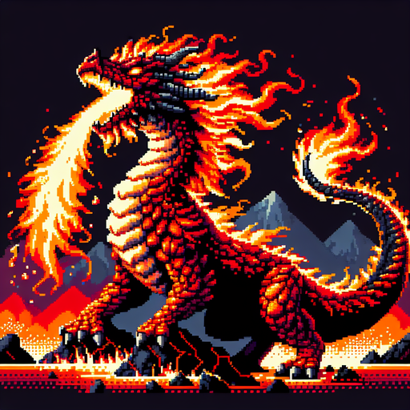

# Draco

**A fantasy dragon world built from a seven-year-old's imagination, preserved as an interactive experience.**

Draco started as a game my son Aza invented. Not on a screen. Just talking. Walking to school, eating dinner, lying on the floor before bed. He'd describe dragons with specific elements, name characters, create rules for how battles worked, build out locations with layered histories. Every day he'd add more. He had an extraordinary memory for the details, and the world kept growing, getting richer and more internally consistent.

I realized I wanted to capture it. Not as a note in my phone, not as a recording, not as a drawing on the fridge. Those are snapshots of a moment. I wanted something that preserved the *play* itself. Something people could interact with. Something that kept the feeling of being inside Aza's world, not just looking at a photo of it.

So I built the Draco Codex and the Draco Adventure game.

## The Draco Codex

An interactive encyclopedia of Aza's world. 86 pieces of pixel art, 9 chapters, dragon cards that flip to reveal stats, an element matchup chart, a searchable glossary, scroll-triggered animations. All the lore comes from transcripts of our conversations, organized into a canonical Game Bible.

**[View the Codex](https://draco-codex.vercel.app)**

## Draco Adventure

An AI-narrated RPG where you play as a Dragonette Keeper in Aza's world. The narrator knows the complete Game Bible (~60K words of lore) and stays faithful to the rules Aza created. You pick your dragon egg, name your dragonette, and explore. The narrator adapts to your choices, tracks your inventory and badges, and introduces characters and locations from the lore.

Voice input (via Whisper) and voice output (via TTS) make it feel like a conversation, which is how the game was born in the first place.

The game requires a login. There is no public signup. If you'd like access, reach out.

## Why This Exists

When your kid makes something remarkable, you save it. A generation ago, that meant putting the drawing on the fridge or recording a video. Today, because building software is more accessible than ever, you can go further. You can turn a child's creation into something people can explore, play with, and experience. Not a memory of the thing, but the thing itself, still alive.

That's what this project is. An artifact of childhood that retains the ability to play.

## Tech

- **Codex:** Static HTML/CSS/JS. No build step. 8-bit pixel art generated with DALL-E 3. Press Start 2P and Space Mono fonts.
- **Adventure:** Anthropic Claude (streaming via SSE) for narration, OpenAI Whisper for voice input, OpenAI TTS for voice output. Neon Postgres for cloud-saved adventures. Vercel serverless functions.
- **Game Bible:** ~60K words of canonical lore extracted from conversation transcripts with Aza, organized into 18 sections.

## Credits

- **Aza Dixon** (age 7) created the world of Draco. Every dragon, character, location, rule, and story element comes from him.
- **Brent Dixon** documented the lore, built the Codex, and wrote the game engine.

## License

CC BY-NC-SA 4.0. You can explore, learn from, and fork this project for personal use. Commercial use is not permitted. See [LICENSE](LICENSE) for details.
