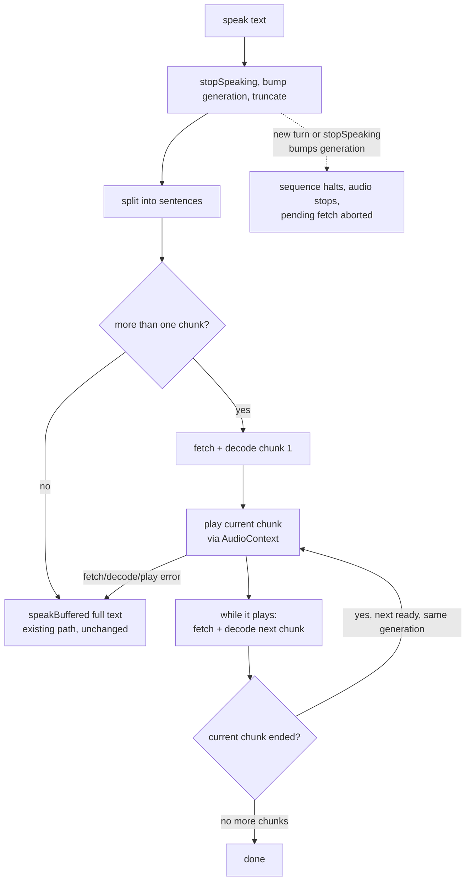

# feat: Sentence-by-sentence narrator voice with read-ahead

## Summary

Make the Draco narrator start talking about a second after a reply appears, instead of waiting for the whole reply to become audio. Split the cleaned narrator text into sentences, play the first one right away, and fetch plus decode the next sentence while the current one plays so playback stays gapless. Every sentence plays through the same already-unlocked Web Audio path the voice uses today, and any failure drops back to the current whole-clip playback untouched.

---

## Problem Frame

The voice works reliably but is slow to start. Today the full reply lands in the chat window, then `speak()` sends the entire text for text-to-speech and waits for the complete MP3 before any sound plays (`codex/game.js`, `speakBuffered`). Narrator replies are often long, so the silence before the first word can run several seconds. For a 7-year-old mid-adventure, that pause kills momentum.

An earlier fix streamed the audio as it generated (MediaSource). It was shelved (saved on the `wip/tts-streaming` branch) because it risked going silent on the iPad and iPhone Aza plays on, and the speed benefit was unverified. This plan takes the opposite bet: change nothing about how audio is played, only how the text is chunked before it reaches the proven playback path. See origin: `docs/brainstorms/2026-06-01-faster-narrator-voice-requirements.md`.

---

## Key Technical Decisions

- **Chunk inside `speak()`, reuse the existing playback.** Splitting and sequencing live at the `speak()` boundary in `codex/game.js`. Both narration paths (auto-speak in `renderNarratorFinal`, the replay button) and the intro line already route through `speak()`, so they all benefit with no other changes.
- **Each sentence plays through the already-unlocked AudioContext, not a new audio player per sentence.** Reuse `speakBuffered`'s primary branch (`decodeAudioData` plus a `BufferSource`), which is the mechanism today's voice already uses successfully. Creating a fresh `HTMLAudioElement` per sentence is exactly the autoplay trap the shelved MediaSource version risked on iOS. This decision is the crux of keeping the iPad safe.
- **Read ahead by one sentence.** While a sentence plays, fetch and decode the next one and hold it ready. Do not fetch all sentences in parallel: that risks out-of-order playback, wasted fetches on interruption, and many simultaneous requests.
- **Any failure falls back to the existing whole-clip path, left untouched.** `speakBuffered` stays exactly as it is today and serves as the fallback. If splitting, fetching, decoding, or playing a sentence fails, abandon the chunked attempt and play the full reply the current way. The floor is exactly today's behavior, never worse.
- **Keep the existing guards.** The `ttsGeneration` counter, `stopSpeaking()`, and the current character cap stay in place. Chunked playback runs inside them so a new turn cleanly cancels an in-progress sequence.
- **The splitter preserves spoken content exactly.** Joining the chunks reproduces the words the voice speaks today (no characters dropped, markdown and sound-effect markers kept), so the narration sounds identical apart from timing.

---

## High-Level Technical Design

`speak()` decides between the existing whole-clip path and the new read-ahead sequencer, and the sequencer always falls back to the whole-clip path on trouble.

The diagram is directional. The prose in Implementation Units is authoritative where they differ.

---

## Requirements

Carried from origin (`docs/brainstorms/2026-06-01-faster-narrator-voice-requirements.md`).

**Playback behavior**
- R1. The first sentence begins playing as soon as its audio is ready, without waiting for the rest of the reply.
- R2. Remaining sentences play in original order, each following the previous with no audible gap under normal conditions.
- R3. While a sentence plays, the next sentence's audio is fetched and decoded in advance (one ahead).
- R4. The full reply is spoken in the same words and the same voice as today. Chunking changes timing only, not content.

**Interruption and lifecycle**
- R5. Starting a new narration stops any in-progress sequence immediately, with no leftover or overlapping audio.
- R6. The sequence cleans up after itself when it finishes or is interrupted, leaving no audio sources, buffers, or fetches running.

**Reliability and fallback**
- R7. If any sentence fails to fetch, decode, or play, the reply falls back to playing as a single clip through the existing method, so the result is never worse than today.
- R8. A reply that is a single sentence, or too short to split, plays exactly as it does today through the existing path.

**Platform**
- R9. iPad and iPhone behavior is unchanged except for speed. No new audio-permission or autoplay requirement is introduced beyond what the current voice relies on.

---

## Acceptance Examples

Carried from origin. These drive the manual test scenarios in the units below.

- AE1. Given a 10-sentence reply, when narration starts, the first sentence is audible within about a second and the second sentence is fetched before the first finishes.
- AE2. Given consecutive sentences, when one ends, the next begins with no noticeable silence.
- AE3. Given a sequence is playing, when the player sends a new message that triggers new narration, the old sequence stops at once with no overlapping voice and nothing left running.
- AE4. Given the third sentence's audio request fails, the reply is re-spoken as a single clip and the player still hears the whole thing.
- AE5. Given a one-sentence reply, narration plays through the existing path with no change from today.

---

## Implementation Units

**Verification note:** this repo has no client-side test runner (no test files, no harness for the browser game code), and adding one is out of scope. All test scenarios below are manual in-browser checks. For the pure splitter (U1), temporary `console.log` of its output is the practical way to confirm behavior during development.

### U1. Sentence splitter

- **Goal:** A pure function that splits the cleaned narrator text into an ordered list of speakable chunks while preserving the exact spoken content.
- **Requirements:** R4; enables R1, R2, R3; supports R8.
- **Dependencies:** none.
- **Files:** `codex/game.js` (new top-level helper near `cleanNarrativeText`).
- **Approach:** Operate on the output of `cleanNarrativeText` (the same text `speak()` sends today, markdown and sound-effect markers intact). Split on sentence-ending punctuation (`.`, `!`, `?`) followed by whitespace or end of string, keeping the punctuation with its sentence. Do not split inside bold or all-caps markup. Merge a trailing fragment that is too short to be worth its own clip (for example, no letters, or under a small character threshold) into the previous chunk. Trim each chunk and drop empties. Guarantee that joining the chunks reproduces the input's words in order, so the voice says the same thing. If there is no sentence boundary, return a single chunk (the whole text).
- **Patterns to follow:** the existing small pure helper `cleanNarrativeText` in `codex/game.js`.
- **Test scenarios (manual):**
  - Covers AE1: a 5-sentence reply produces 5 chunks in order; the joined chunks equal the input words.
  - A sound-effect lead-in like `**WHOOSH!** The cave shakes.` splits sensibly and both chunks keep their text.
  - A tiny trailing fragment (for example a lone `Go!`) is merged into the previous chunk rather than fetched alone.
  - Text with no terminal punctuation returns a single chunk.
  - Empty or whitespace-only input returns no chunks (the caller skips speaking).
- **Verification:** log the chunks for several representative narrations and confirm order plus content-preservation against the text spoken today.

### U2. Fetch-decode and play primitives (separated for read-ahead)

- **Goal:** Provide the two small primitives the sequencer needs: one that fetches and decodes a chunk into a ready-to-play audio buffer, and one that plays a decoded buffer and resolves when it finishes. Keeping them separate is what lets the sequencer prepare the next sentence while the current one plays (R3).
- **Requirements:** R9, R3; enables R1, R2.
- **Dependencies:** none (used by U3).
- **Files:** `codex/game.js` (two new methods on the `app` object alongside `speakBuffered`).
- **Approach:**
  - A fetch-decode primitive: fetch `/api/speak` for the chunk using the same request shape `speakBuffered` uses today, read the `arrayBuffer`, and `audioContext.decodeAudioData` into an audio buffer that it returns. Accept an abort signal so an in-flight fetch can be cancelled (used by U4). Reject on fetch or decode failure.
  - A play primitive: take a decoded buffer, create a `BufferSource`, connect to the destination, start, and return a promise that resolves on the source's `onended`. Set the existing `ttsSourceNode` so `stopSpeaking()` can stop it. If `ttsGeneration` changed before play, do nothing and resolve quietly.
  - Use the AudioContext path only. Do not add a per-chunk `HTMLAudioElement` or `speechSynthesis` fallback here, so any failure surfaces as a rejection and U3 falls back to the whole-clip path.
- **Patterns to follow:** the primary AudioContext branch of `speakBuffered` in `codex/game.js` (`decodeAudioData`, `createBufferSource`, `onended`), split into its fetch-decode and play halves.
- **Test scenarios (manual):**
  - Fetch-decode resolves to a usable buffer for a normal chunk; a forced fetch failure rejects it.
  - Play resolves only after the audio ends (the next action fires after the sound stops).
  - Aborting the signal mid-fetch cancels the request without playing.
- **Verification:** a chunk fetch-decodes to a buffer, that buffer plays to completion and signals done, and an induced failure rejects so the caller can fall back.

### U3. Read-ahead sequencer and `speak()` wiring

- **Goal:** Speak a multi-sentence reply by playing chunks in order, fetching and decoding the next while the current plays, with no audible gap; fall back to the existing whole-clip path on any failure; route single or short replies straight to the existing path.
- **Requirements:** R1, R2, R3, R7, R8.
- **Dependencies:** U1, U2.
- **Files:** `codex/game.js` (new `speakChunked` method; modify `speak()` to call it; leave `speakBuffered` untouched as the fallback).
- **Approach:** In `speak()`, after the existing `stopSpeaking()`, generation bump, and truncation, split via U1. If there is one chunk or fewer, call `speakBuffered(fullText)` (R8). Otherwise call `speakChunked`. The sequencer uses U2's two primitives: fetch-decode the first chunk and await it, then loop. For each chunk, start playing the already-decoded buffer (do not await yet), immediately kick off the fetch-decode of the next chunk concurrently (one ahead, no more), then await the current chunk's play-completion, then await the next chunk's prepared buffer before advancing. When the generation is still current, continue to the prepared next chunk. On any rejection, fetch, or decode error, abandon the chunked attempt and call `speakBuffered(fullText)` once as the fallback (R7), guarding so the fallback does not start if a newer generation has already taken over (prevents double audio). Keep `ttsSpeaking` correct across the lifecycle.
- **Patterns to follow:** the existing `speak()` try-then-fallback shape (it previously tried streaming, then buffered); reuse `speakBuffered` verbatim as the fallback.
- **Test scenarios (manual):**
  - Covers AE1, AE2: a long reply starts speaking within about a second and flows with no gaps between sentences.
  - Covers AE4: block or fail one mid-sequence request; the reply is re-spoken as a single clip and the whole thing is heard.
  - Covers AE5: a one-sentence reply plays through the existing path, unchanged.
  - Read-ahead: confirm the next sentence's request begins before the current sentence finishes (browser network panel or temporary logging).
- **Verification:** multi-sentence narration starts fast and is gapless; an induced failure falls back to the whole clip; a single-sentence reply is unchanged.

### U4. Interruption and cleanup

- **Goal:** A new narration or `stopSpeaking()` immediately stops any in-progress sequence, drops pending fetches, and leaves nothing running, with no overlap.
- **Requirements:** R5, R6.
- **Dependencies:** U3.
- **Files:** `codex/game.js` (extend `stopSpeaking()` and the sequencer to use an abort controller and honor the generation counter).
- **Approach:** Give each `speakChunked` run an abort controller and pass its signal to the per-chunk fetch (U2). `stopSpeaking()` already bumps `ttsGeneration`; also abort the controller and stop the active source so the current chunk halts at once. The sequencer checks the generation before starting each next chunk and exits if superseded, releasing its references (no dangling sources, buffers, or controllers). Starting a new `speak()` already calls `stopSpeaking()` first, so a new turn cancels cleanly. Discard any prefetched-but-unplayed next chunk on interruption.
- **Patterns to follow:** the existing `ttsGeneration` guard pattern used throughout `speakBuffered` in `codex/game.js`.
- **Test scenarios (manual):**
  - Covers AE3: while a sequence plays, send a new message that triggers new narration; the old sequence stops immediately with no overlapping voices and nothing left running.
  - Toggling Voice off mid-sequence stops playback at once.
  - Rapid re-trigger: fire two narrations quickly; only the newest is heard.
- **Verification:** interrupting mid-sentence silences the old sequence instantly and the new one starts clean; two voices never overlap; repeated interruptions do not accumulate audio.

---

## Scope Boundaries

**Deferred for later**
- Starting the voice while the AI is still writing the reply (speaking the first sentence before the full text lands). Higher upside, but it touches the working chat-stream path.
- Reviving the shelved MediaSource streaming approach on the `wip/tts-streaming` branch.

**Separate, complementary effort**
- Making the narrator say less (`docs/narrator-brevity-plan.md`). Shorter replies also reduce the wait, but that is its own change.

**Not changing**
- The voice, the TTS model, the wording of narration, the `/api/speak` server, or the existing character cap.

---

## Risks & Dependencies

- **iPad and iPhone autoplay assumption (R9).** Sequential chunks rely on the already-unlocked AudioContext. Today's single-clip auto-speak already uses that context, so the bet is low-risk, but it must be confirmed on Aza's actual device. If it does not hold, the whole-clip fallback (today's behavior) still works, so the floor is preserved.
- **Per-request cost.** One OpenAI TTS request per sentence instead of one per reply. Billing is per input character, so total characters and cost are roughly unchanged; only the request count rises.
- **Network variability.** If a chunk's fetch is slow despite read-ahead, a small gap can appear between sentences. Still better than today, and a slow or failed fetch routes to the fallback.

---

## Open Questions

**Resolve before shipping (verification, not a planning blocker)**
- Confirm on Aza's actual iPad or iPhone that sequential chunks auto-play without a fresh tap. If they do not, keep the feature behind the existing fallback.

**Deferred to implementation**
- The exact short-fragment merge threshold and the precise split rule, tuned by listening to real narrations.

---

## Sources / Research

- `codex/game.js`: `speak` (around line 1086), `speakBuffered` (around 1235), `speakBrowserFallback` (around 1300), `stopSpeaking` (around 1313), `cleanNarrativeText` (around 702), `renderNarratorFinal` (around 1025), `unlockAudio` and the silent-buffer unlock (around 1068).
- `api/speak.js`: OpenAI TTS (`tts-1`, voice `nova`), returns the full MP3 buffer.
- Origin requirements: `docs/brainstorms/2026-06-01-faster-narrator-voice-requirements.md`.
- No client-side test harness exists in this repo; verification is manual in-browser.
